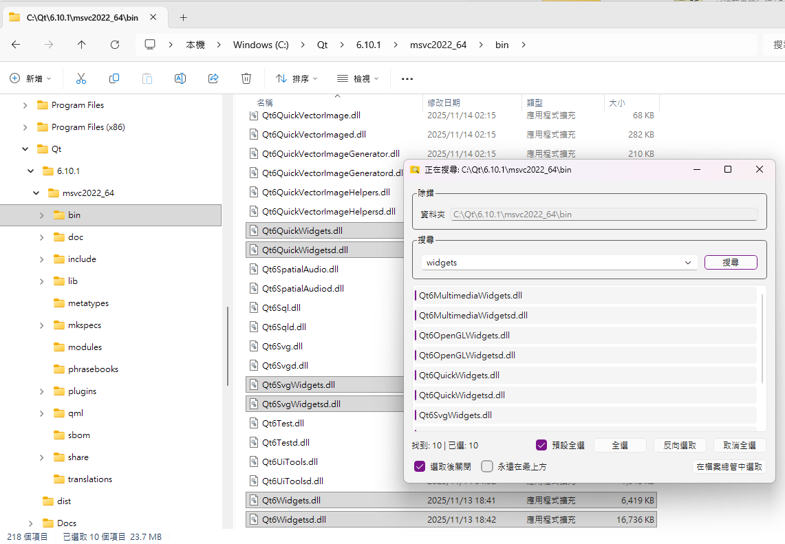

# Windows Explorer Selector

版本：0.2.0

> [!CAUTION]
> **⚠️ 警語：本專案之程式碼、文件與圖示由 Gemini 和 GPT 5.6 協助產生。**  
> 使用者應自行評估安全風險，作者不保證程式碼的絕對正確性與安全性。

這是一個 Windows 檔案總管增強工具，提供即時搜尋並直接在原生檔案總管視窗中選取檔案的功能。



## 功能特色

*   **常駐執行 (Resident Mode)**：
    *   程式啟動後會縮小至系統匣 (System Tray)。
    *   支援單一執行實體 (Single Instance)，透過具名管道 (Named Pipe) 進行高效處理。
*   **常駐搜尋與選取**：
    *   主程式常駐於系統匣，預設按下 `Ctrl + F3` 即可針對目前開啟的檔案總管視窗搜尋與選取檔案。
    *   快速鍵可於設定中自定義。
*   **右鍵選單整合 (選用)**：
    *   可選擇安裝 Shell Extension，將「尋找檔案」整合至檔案總管右鍵選單。
    *   未安裝插件不影響主程式的常駐、快速鍵搜尋與檔案選取功能。
*   **進階搜尋與選取**：
    *   **雙向連動**：點兩下搜尋結果即可在檔案總管中選取；點擊「在檔案總管選取」可批次選取所有選中項。
    *   **多選支持**：支援選取全部、反向選取、全部取消。
    *   **預設自動全選**：可設定搜尋後自動選取所有結果。
*   **個人化設定**：
    *   **多國語言**：支援英文、繁體中文介面切換（需重啟生效）。
    *   **自動啟動**：支援隨 Windows 登入時自動執行。
    *   **最上層顯示**：保持搜尋視窗永遠在最前方。
    *   **選取後自動關閉**：執行選取動作後自動隱藏視窗。

## 系統需求

*   Windows 11 (64-bit)
*   Visual Studio 2026 (用於編譯)
*   Qt 6.11.2 (MSVC 2022 64-bit)

## 專案結構

*   **ExplorerSelector** (EXE): Qt 6 應用程式，負責常駐執行、搜尋介面、全域快速鍵與檔案總管控制；可獨立運作。
*   **SelectorExplorerPlugin** (DLL，可選): Windows Shell Extension，提供檔案總管右鍵選單整合。
*   **AppxManifest.xml** / **Install.ps1**: 用於 Windows 11 Sparse Package 註冊的設定與腳本。

## 編譯說明

1.  確保已安裝 Visual Studio 2026 與 Qt 6.11.2 (並包含 Network 模組)。
2.  開啟 `ExplorerSelector.slnx`。
3.  選擇 `Release` 設定，平台選擇 `x64`。
4.  建置方案 (Build Solution)。

## 手動安裝（選用）

主程式不需要安裝或註冊插件即可運作。若要使用檔案總管右鍵選單或 Windows 11 第一層選單整合，才需要註冊 DLL：

1.  **註冊右鍵選單**：
    以**系統管理員身分**執行：
    ```powershell
    regsvr32 "SelectorExplorerPlugin.dll"
    ```
2.  **執行主程式**：
    執行 `ExplorerSelector.exe` 後，會在系統匣看到圖示。

您可能需要先安裝 Visual C++ v14 可轉發套件：https://aka.ms/vc14/vc_redist.x64.exe

## 注意事項

*   **搜尋中的狀態**：搜尋時會在列表顯示 "Searching..." 並鎖定列表，搜尋完成後自動恢復。
*   **萬用字元**：支援 `*` 與 `?` 萬用字元搜尋。
*   **單一實體**：本程式使用 `QLocalServer` 確保單一執行實體。

## 授權與聲明 (License)

*   本軟體使用 **Qt Framework** (Qt 6)，依據 **LGPL v3** 授權協議進行動態連結 (Dynamic Linking)。
*   Qt 是 The Qt Company Ltd. 的註冊商標。
*   本專案的原始碼與修改均應符合 LGPL 規範，確保使用者有權更換所使用的 Qt 函式庫版本。
*   詳細授權資訊請參閱程式設定頁面中的 "About Qt" 或安裝目錄下的 LICENSE 文件。
