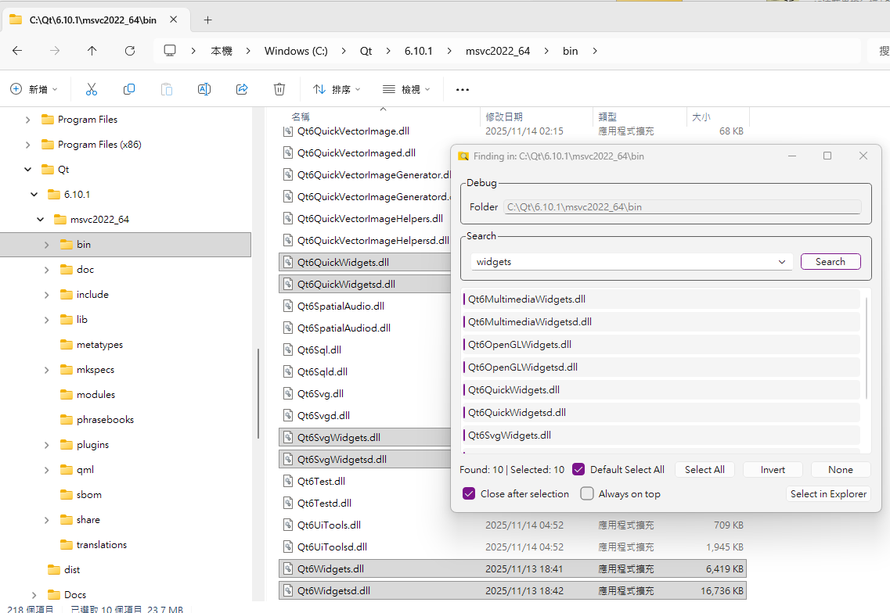

# Windows Explorer Selector

Version: 0.2.0

> [!CAUTION]
> **⚠️ Caution: The code, documentation, and icons in this project were generated with assistance from Gemini and GPT 5.6.**  
> Users should assess the safety risks themselves; the author does not guarantee the absolute correctness or security of the code.

This is a Windows Explorer enhancement tool that provides real-time search and file selection directly within the native Explorer window.



## Features

*   **Resident Mode**:
    *   The program minimizes to the system tray after launch.
    *   Supports single instance handling via a named pipe for efficient processing.
*   **Resident Search and Selection**:
    *   The main program runs in the system tray. Press the default `Ctrl + F3` hotkey to search and select files in the currently open Explorer window.
    *   The hotkey can be customized in the settings.
*   **Shell Extension Integration (Optional)**:
    *   Optionally install the Shell Extension to add "Find File" to the Explorer context menu.
    *   The main program's resident mode, hotkey search, and file selection work without the plugin.
*   **Advanced Search and Selection**:
    *   **Bidirectional Linking**: Double-click a search result to select it in Explorer; click "Select in Explorer" to batch select all highlighted items.
    *   **Multi-select Support**: Supports Select All, Invert Selection, and Clear All.
    *   **Auto Select All (Default)**: Can be configured to automatically select all results after a search.
*   **Personalization**:
    *   **Multi-language**: Supports switching between English and Traditional Chinese (requires restart).
    *   **Auto-start**: Supports running automatically at Windows logon.
    *   **Stay on Top**: Keep the search window always in front.
    *   **Auto-close After Selection**: Automatically hide the window after performing a selection action.

## System Requirements

*   Windows 11 (64-bit)
*   Visual Studio 2026 (for compilation)
*   Qt 6.11.2 (MSVC 2022 64-bit)

## Project Structure

*   **ExplorerSelector** (EXE): Qt 6 application responsible for resident mode, the search interface, global hotkey, and Explorer control; it works independently.
*   **SelectorExplorerPlugin** (DLL, optional): Windows Shell Extension that provides Explorer context-menu integration.
*   **AppxManifest.xml** / **package.ps1**: Configuration and scripts for Windows 11 Sparse Package registration and packaging.

## Build Instructions

1.  Ensure Visual Studio 2026 and Qt 6.11.2 (with the Network module) are installed.
2.  Open `ExplorerSelector.slnx`.
3.  Select the `Release` configuration and `x64` platform.
4.  Build the solution.

## Manual Installation (Optional)

The main program does not require the plugin to be installed or registered. Register the DLL only if you want Explorer context-menu or Windows 11 first-level menu integration:

1.  **Register the context menu**:
    Run as **Administrator**:
    ```powershell
    regsvr32 "SelectorExplorerPlugin.dll"
    ```
2.  **Run the main program**:
    Launch `ExplorerSelector.exe`; you will see the icon in the system tray.

You may need to install Visual C++ v14 Redistributable Package first: https://aka.ms/vc14/vc_redist.x64.exe

## Notes

*   **Searching Status**: While searching, the list will display "Searching..." and be locked; it automatically recovers when the search is complete.
*   **Wildcards**: Supports `*` and `?` wildcard character searches.
*   **Single Instance**: This program uses `QLocalServer` to ensure only a single instance is running.

## License and Disclaimer

*   This software uses the **Qt Framework** (Qt 6), dynamically linked under the **LGPL v3** license.
*   Qt is a registered trademark of The Qt Company Ltd.
*   The source code and modifications of this project should comply with LGPL requirements, ensuring users have the right to replace the version of the Qt library used.
*   For detailed license information, please refer to "About Qt" in the application settings or the LICENSE files in the installation directory.
